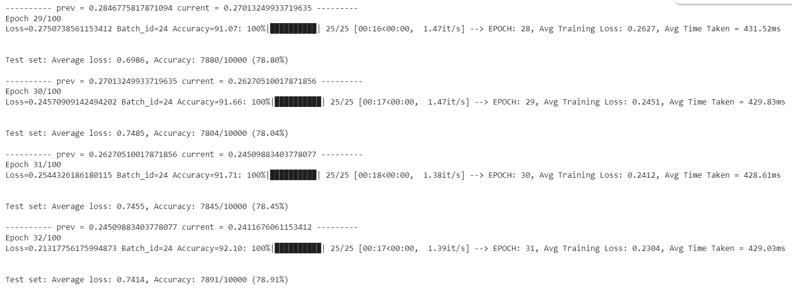
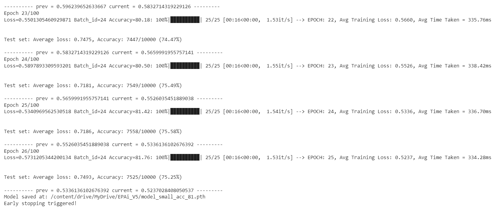
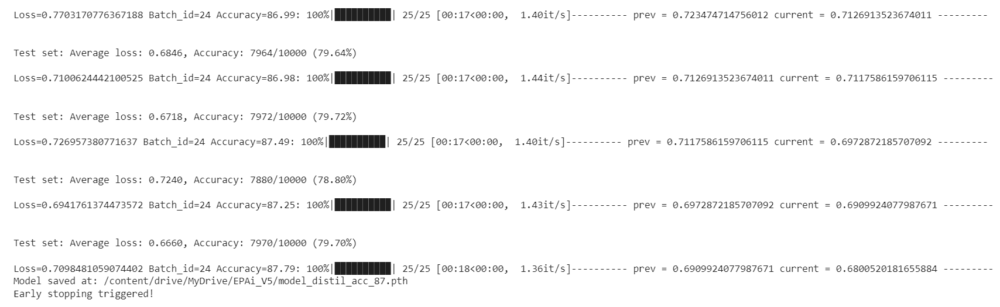

# EPAiV5-Session29 : Specialized Loss Functions

# Overview
This assignment implements Knowledge Distillation using KL Divergence Loss in PyTorch. The goal is to train a smaller student model by transferring knowledge from a larger teacher model, optimizing for efficiency while maintaining performance.

### TLDR

| Item                    | Train Accuracy | Test Accuracy | Change in Accuracy |
|-------------------------|----------------|---------------|--------------------|
| Teacher Model           | 92.10%         | 78.91%        | NA                 |
| Student Model           | 81.76%         | 75.25%        | NA                 |
| Distilled Student Model | 87.79%         | 79.70%        | Train = ~6.03%     |
|                         |                |               | Test = ~4.45%      |
                                               
## Detailed Explanation
### Teacher Model
The TeacherModel is a deep neural network trained on CIFAR-10. It serves as the source of knowledge by providing softened probability distributions over classes. This model is custom-built and trained from scratch on CIFAR-10. It is a 729,712 (929k) parameter model trained for CIFAR-10 dataset 100 epochs with early stopping enabled. The model accuracy is as summarized in above table.




## Student Model
The StudentModel is a smaller neural network trained using the distilled knowledge from the teacher model. It has a simpler architecture compared to the teacher model, making it more efficient for deployment while maintaining competitive accuracy. Student model is a 230,192 (230k) parameter model trained for CIFAR-10 dataset 100 epochs with early stopping enabled. The model is **roughly 3 times smaller** than the teacher model. The model accuracy is as summarized in the above table. Logs from last 2 epochs is as follows:



## Distilled Student Model
Now, student model is trained using knowldege distillation. The teacher model is used as the knowledge source. The student model is trained for 100 epochs with early stopping enabled. KL divergence loss is used as the distillation loss along with cross entropy loss. 

```python
    # Compute losses
    loss_soft = soft_loss(student_probs, teacher_probs) * (T ** 2)  # Scale by T^2
    loss_hard = hard_loss(student_logits, target)
    loss = alpha * loss_hard + (1 - alpha) * loss_soft

    epoch_loss += loss.item()
```
By this process model's train and test accuracy is improved by ~6.03% and ~4.45% respectively.



## Training Process

`Data Preprocessing`: 
    - Uses transformations such as RandomAffine and Normalization to augment the training data.

`Teacher Model Training`: 
    - The TeacherModel is first trained on CIFAR-10 to establish high accuracy.

`Knowledge Distillation Training`: 
    - The StudentModel is trained using KL Divergence Loss with temperature scaling.
    - It learns from both the hard labels and the soft probability distribution from the teacher model.
    - Optimization is performed using Stochastic Gradient Descent (SGD) with a momentum factor and weight decay.

## Evaluation and Results

`Test Accuracy and Loss`: 
    - The test accuracy and loss trends are monitored throughout training.
    - Logs include per-epoch performance tracking.

`Model Performance`: 
    - The student model is expected to achieve competitive accuracy while being significantly smaller and faster.

`Evaluation Phase`: 
    - The evaluation phase includes visualizing predictions and analyzing misclassifications.

## Expected Results

    - The student model achieves good performance while being more lightweight.
    - Accuracy and loss trends demonstrate the effectiveness of knowledge distillation.
    - Logs provide insights into model performance during training and testing.

## Requirements

Ensure you have the following dependencies installed:

```
pip install torch torchvision torchsummary tqdm matplotlib numpy
```
